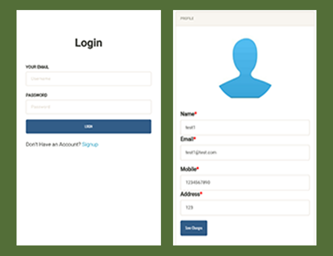

# PHP-MySQL-Firebase
This is simple bootstrap web site written by php.

It uses MySql and Firebase.
Firebase supports Android , iOS and Unity, React but not Php.
So, It needs to use the Php Firebase Admin SDK for access the firebase via php.

I used the PHP Firebase Admin SDK to read/write the data from Firebase.
This is no laravel but pure php web site.

- create firebase project 

- Install the PHP Firebase Admin SDK in your console
  $ composer require kreait/firebase-php
  
- Add the authentication json to your project 
  (how to get the authentication json file? please lookat this video https://www.youtube.com/watch?v=3ACxp56r7ag)
  
- how to connect to firebase realtime db  
  require_once __DIR__ . '/vendor/autoload.php'; 
  
  use Kreait\Firebase\Factory;  
  use Kreait\Firebase\ServiceAccount;  
  
  //. get reference to firebase realtime database  
  $serviceAccount = ServiceAccount::fromJsonFile(__DIR__ . '/groupmsgapp-4507d-c26e80f7117a.json'); // add the authentication file to your php project  
  $firebase = (new Factory)->withServiceAccount($serviceAccount)->create();  
  $this->database = $firebase->getDatabase();  
  
  //. read child  
  $reference = $this->database->getReference($this->db_group)  
  $snapshotGroup = $reference->getSnapshot();   
  $groups = $snapshotGroup->getValue();   
  
  //. write child  
  $data = array();  
  $data["name"] = $group;    
  $path = $this->db_group.'/'.$custom_child;  
  $reference = $this->database->getReference($path);  
  $postKey= $reference->push($data);  
  
  //. remove child and subchild  
  $reference = $this->database->getReference($path);  
  $reference->remove();  
  
You can see the more details via https://firebase-php.readthedocs.io/en/stable/setup.html  

Enjoy it. 
 
